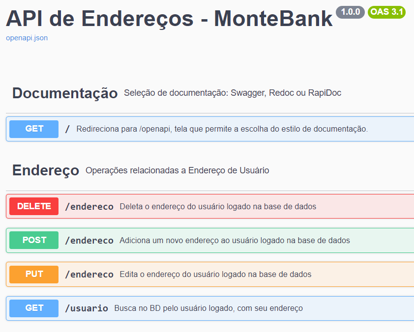
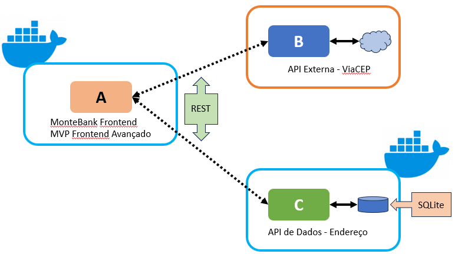

# MonteBank - Backend de Endereço

## Sobre o projeto

O objetivo deste projeto é implementar um MVP de um API backend REST responsável por tratar endereços de usuários. Funciona em conjunto com o frontend disponível neste [repositório](https://github.com/marcelo-monte/puc-rj-mvp-sprint3-backend-avancado-frontend). Possibilita a inclusão, remoção, edição e visualização do endereço de um usuário.

Este projeto fez parte do MVP da Sprint 3 da Pós-Graduação da PUC-RJ (Backend avançado)

### 🛠️Tecnologias Principais

<ul>
  <li>Python 3.12</li>
  <li>Flask 3.0.0</li>
  <li>SQLite</li>
  <li>SQAlchemy 2.0.23</li>
  <li>flask-openapi3 3.0.1</li>
</ul>

### 📑Regras de negócio

- Inclusão, remoção, edição e visualização do endereço de um usuário
- 

### Endpoints

- User Endpoints

| URL / ENDPOINT | VERBO  | DESCRIÇÃO                          |
| -------------- | ------ | ---------------------------------- |
| /usuario       | GET    | Retorna o usuário com seu endereço |
| /endereco      | POST   | Cria um endereço para o usuário    |
| /endereco      | DELETE | Remove o endereço do usuário       |
| /endereco      | PUT    | Edita o endereço do usuário        |


## Documentação

- Lista das rotas no Swagger
<div align="center">
  
</div>
<br>

- Arquitetura do projeto
<div align="center">
  
</div>
<br>

## Instruções de Uso

Seguem as instruções para a instalação, configuração e uso da aplicação.

### Instalação

1. Clone do repositório

```sh
   git clone git@github.com:marcelo-monte/puc-rj-mvp-sprint3-backend-avancado-api.git
   cd puc-rj-mvp-sprint3-backend-avancado-api
```

2. Criar um virtual environment, na raiz do projeto:

```
  python.exe -m venv .env
```

3. Instalando os pacotes

```
    pip install -r requirements.txt
```

### Execução local

1. Rodando a aplicação localmente

```
  (env)$ flask run --host 0.0.0.0 --port 5000
```

2. Rodando em modo de desenvolvimento

```
  (env)$ flask run --host 0.0.0.0 --port 5000 --reload
```

3. Abra a URL abaixo no browser para visualizar a documentação no Swagger

```
  http://localhost:5000/
```

### Docker

1. Na raiz do projeto, execute:

```
  docker build -t rest-api .
```

2. Execute o container:
   
```
  docker run -p 5000:5000 rest-api
```

3. Abra a URL abaixo no browser para visualizar a documentação no Swagger

```
  http://localhost:5000/
```

## Desenvolvedor

- [Github](https://github.com/marcelo-monte)
- [Linkedin](https://www.linkedin.com/in/marcelo-monte-fernandes/)